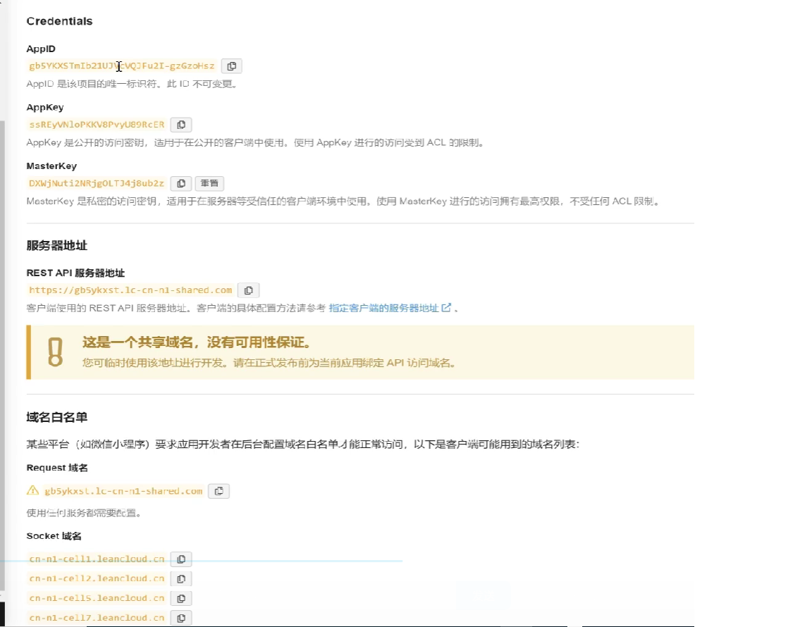
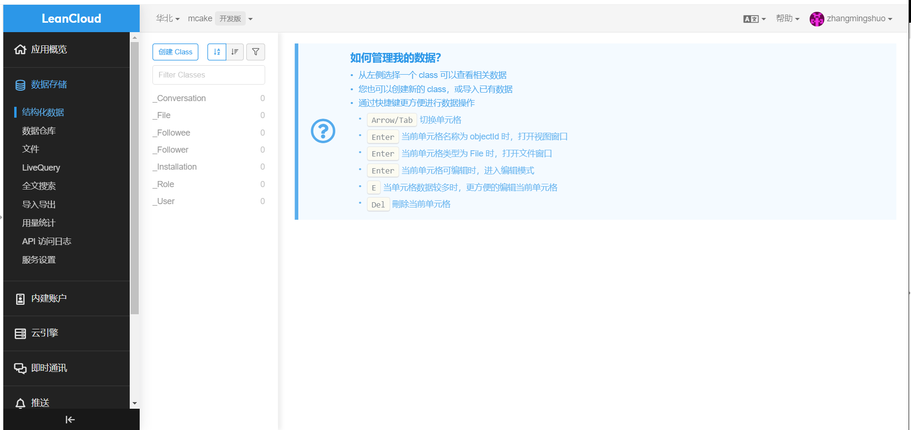
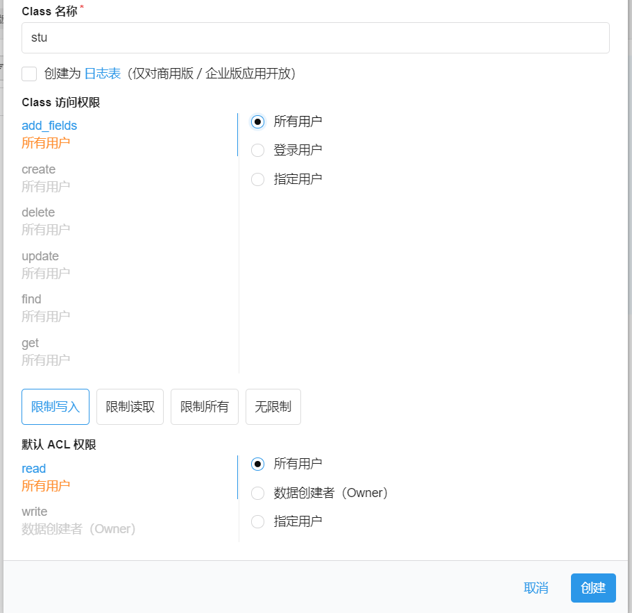
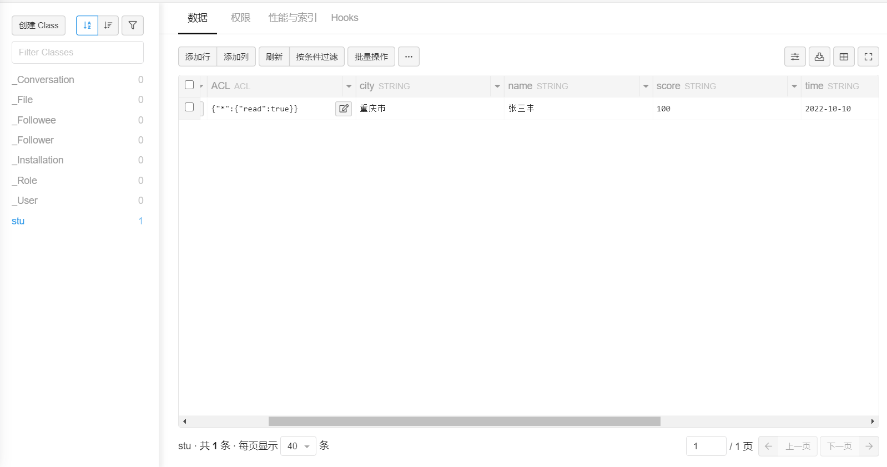

# umi project

## Getting Started

Install dependencies,

```bash
$ yarn
```

Start the dev server,

```bash
$ yarn start
```

为request配置请求拦截器与响应拦截器  
[umi的运行时配置](https://v3.umijs.org/zh-CN/docs/runtime-config)  
约定`src/app.tx`为运行时配置
```js
export const request = {
  requestInterceptors:[//请求拦截
    (url,options)=>{
      console.log('请求拦截器',url,options)
      return options  //此处是自定义请求配置
    }
  ],

  responseInterceptors:[//响应拦截
    (response,options)=>{
      console.log('请求拦截器',response,options)
      return response
    }
  ]
}
``` 

LeanCloud云服务介绍及应用容器创建



LeanCloud Restful风格API介绍及使用  
[LeanCloud rest_api](https://leancloud.cn/docs/rest_api.html)  
LeanCloud文档-RESTAPI-数据存储RESTAPI-对象-创建对象  

在ApiFox测试接口可访问性
```shell
[
    {
        "bid":1,
        "bname":"所有蛋糕",
        "num":38,
        "scene":[
            {
                "bid":1,
                "tgid":3,
                "tid":193,
                "tname":"生日",
                "class":"cj_2",
                "num":33
            },
            {
                "bid":1,
                "tgid":3,
                "tid":194,
                "tname":"聚会",
                "class":"cj_5",
                "num":24
            },
            {
                "bid":1,
                "tgid":3,
                "tid":195,
                "tname":"情侣",
                "class":"cj_3",
                "num":5
            },
            {
                "bid":1,
                "tgid":3,
                "tid":196,
                "tname":"儿童",
                "class":"cj_4",
                "num":6
            },
            {
                "bid":1,
                "tgid":3,
                "tid":197,
                "tname":"长辈",
                "class":"cj_",
                "num":15
            },
            {
                "bid":1,
                "tgid":3,
                "tid":198,
                "tname":"下午茶",
                "class":"cj_1",
                "num":32
            }
        ],
        "english":[

        ],
        "list":[
            {
                "bid":1,
                "tgid":1,
                "tid":33,
                "tname":"拿破仑",
                "class":"kw_03",
                "num":3
            },
            {
                "bid":1,
                "tgid":1,
                "tid":34,
                "tname":"奶油",
                "class":"kw_05",
                "num":18
            },
            {
                "bid":1,
                "tgid":1,
                "tid":35,
                "tname":"慕斯",
                "class":"kw_04",
                "num":15
            },
            {
                "bid":1,
                "tgid":1,
                "tid":36,
                "tname":"芝士",
                "class":"kw_06",
                "num":11
            },
            {
                "bid":1,
                "tgid":1,
                "tid":37,
                "tname":"巧克力",
                "class":"kw_07",
                "num":14
            },
            {
                "bid":1,
                "tgid":1,
                "tid":38,
                "tname":"咖啡",
                "class":"kw_08",
                "num":4
            },
            {
                "bid":1,
                "tgid":1,
                "tid":39,
                "tname":"坚果",
                "class":"kw_02",
                "num":1
            },
            {
                "bid":1,
                "tgid":1,
                "tid":40,
                "tname":"水果",
                "class":"kw_01",
                "num":10
            },
            {
                "bid":1,
                "tgid":1,
                "tid":186,
                "tname":"冰淇淋",
                "class":"kw_09",
                "num":2
            }
        ]
    },
    {
        "bid":11,
        "bname":"所有面包",
        "num":19,
        "scene":[

        ],
        "english":[

        ],
        "list":[

        ]
    },
    {
        "bid":6,
        "bname":"小食",
        "num":12,
        "scene":[

        ],
        "english":[

        ],
        "list":[

        ]
    },
    {
        "bid":5,
        "bname":"配件",
        "num":7,
        "scene":[

        ],
        "english":[

        ],
        "list":[

        ]
    }
]
```

在umi配置LeanCloud服务接口  
数据存储

创建Class

新增一条数据


管理平台的业务功能分析  
1.Banner管理  
发布Banner  
Banner列表

2.分类管理  
录入分类  
分类列表   

3.商品管理  
录入商品  
商品列表  

4.配送范围  
录入配送城市  
录入配送范围  

5.用户管理  
分配管理员账号  
用户角色列表  
用户列表  


使用Form表单搭建商品分类录入页
```js
import { Button, Form, Input } from 'antd';
import React from 'react';


const layout = {
  labelCol: {
    span: 6,
  },
  wrapperCol: {
    span: 16,
  },
};
const tailLayout = {
  wrapperCol: {
    offset: 8,
    span: 16,
  },
};

const CatePub = () => {
  const [form] = Form.useForm();

  const onGenderChange = (value) => {
    switch (value) {
      case 'male':
        form.setFieldsValue({
          note: 'Hi, man!',
        });
        return;

      case 'female':
        form.setFieldsValue({
          note: 'Hi, lady!',
        });
        return;

      case 'other':
        form.setFieldsValue({
          note: 'Hi there!',
        });
    }
  };

  const onFinish = (values) => {
    console.log(values);
  };

  const onReset = () => {
    form.resetFields();
  };

  return (
    <Form {...layout} form={form} name="control-hooks" onFinish={onFinish}>
      <Form.Item
        name="catename"
        label="分类名称"
        rules={[
          {
            required: true,
          },
        ]}
      >
        <Input />
      </Form.Item>
      <Form.Item
        name="gender"
        label="Gender"
        rules={[
          {
            required: true,
          },
        ]}
      >
        <Select
          placeholder="Select a option and change input text above"
          onChange={onGenderChange}
          allowClear
        >
          <Option value="male">male</Option>
          <Option value="female">female</Option>
          <Option value="other">other</Option>
        </Select>
      </Form.Item>
      <Form.Item
        noStyle
        shouldUpdate={(prevValues, currentValues) => prevValues.gender !== currentValues.gender}
      >
        {({ getFieldValue }) =>
          getFieldValue('gender') === 'other' ? (
            <Form.Item
              name="customizeGender"
              label="Customize Gender"
              rules={[
                {
                  required: true,
                },
              ]}
            >
              <Input />
            </Form.Item>
          ) : null
        }
      </Form.Item>
      <Form.Item {...tailLayout}>
        <Button type="primary" htmlType="submit">
          提交
        </Button>
        <Button htmlType="button" onClick={onReset}>
          重置
        </Button>
      </Form.Item>
    </Form>
  );
};

export default CatePub;

```
